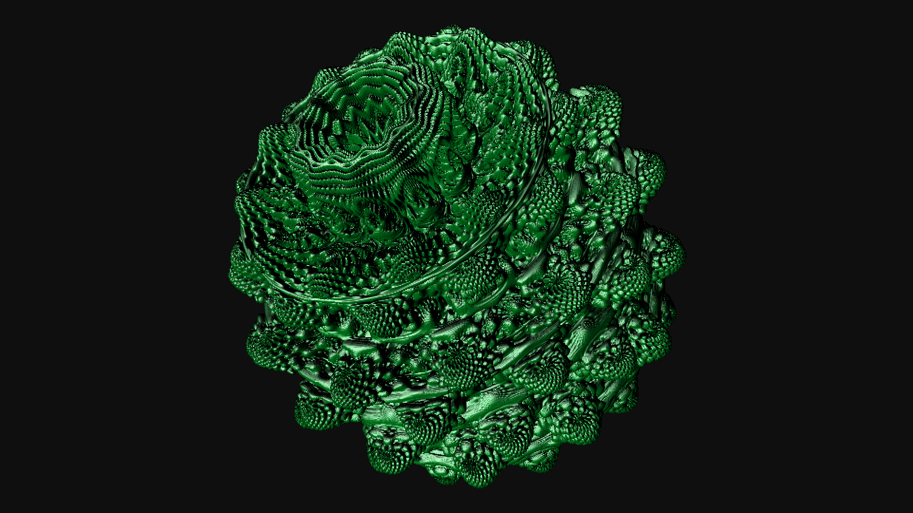

# 3D-Fractal-Mandelbulb

https://youtu.be/vDmg1XNxkCw

The Mandelbub fractal is rendered here, it can be rotated and scaled. To move a fractal, you must first reduce the quality of the rendering using the "X" key, then you can rotate it using the "left", "right", "up", "down" keys and scale it using the "W", "S" keys. And at the end with the "Z" key again set the maximum quality of rendering. ("Z", "X" - increase, decrease quality from 1 to 6 times)

Fractal rendered using ray marching methods
